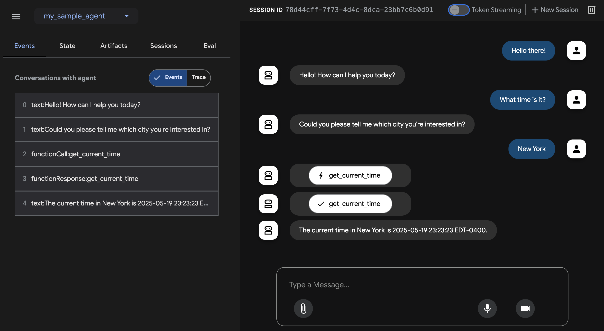
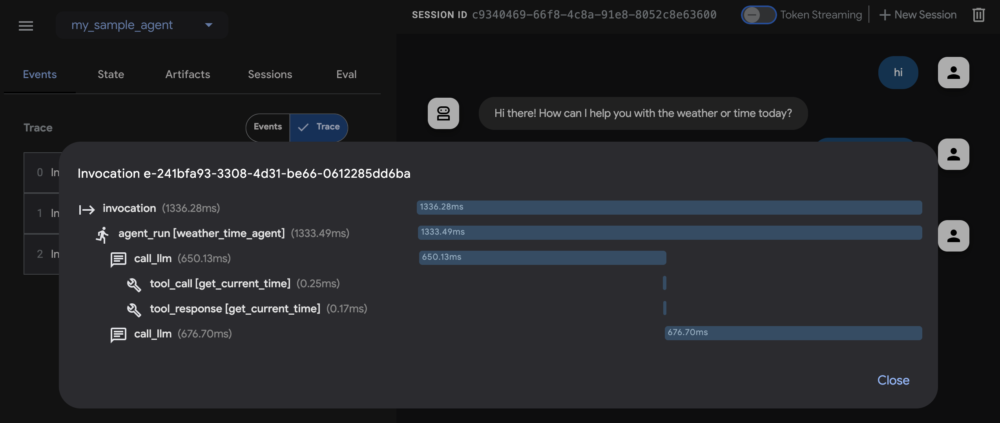

# Quickstart

This quickstart guides you through installing the Agent Development Kit (ADK),
setting up a basic agent with multiple tools, and running it locally either in the terminal or in the interactive, browser-based dev UI.

<!--  -->

This quickstart assumes a local IDE (VS Code, PyCharm, IntelliJ IDEA, etc.)
with Python 3.9+ or Java 17+ and terminal access. This method runs the
application entirely on your machine and is recommended for internal development.

## 1. Set up Environment & Install ADK {#venv-install}

=== "Python"

    Create & Activate Virtual Environment (Recommended):

    ```bash
    # Create
    python -m venv .venv
    # Activate (each new terminal)
    # macOS/Linux: source .venv/bin/activate
    # Windows CMD: .venv\Scripts\activate.bat
    # Windows PowerShell: .venv\Scripts\Activate.ps1
    ```

    Install ADK:

    ```bash
    pip install google-adk
    ```

=== "Java"

    To install ADK and setup the environment, proceed to the following steps.

## 2. Create Agent Project {#create-agent-project}

### Project structure

=== "Python"

    You will need to create the following project structure:

    ```console
    parent_folder/
        multi_tool_agent/
            __init__.py
            agent.py
            .env
    ```

    Create the folder `multi_tool_agent`:

    ```bash
    mkdir multi_tool_agent/
    ```

    !!! info "Note for Windows users"

        When using ADK on Windows for the next few steps, we recommend creating
        Python files using File Explorer or an IDE because the following commands
        (`mkdir`, `echo`) typically generate files with null bytes and/or incorrect
        encoding.

    ### `__init__.py`

    Now create an `__init__.py` file in the folder:

    ```shell
    echo "from . import agent" > multi_tool_agent/__init__.py
    ```

    Your `__init__.py` should now look like this:

    ```python title="multi_tool_agent/__init__.py"
    --8<-- "examples/python/snippets/get-started/multi_tool_agent/__init__.py"
    ```

    ### `agent.py`

    Create an `agent.py` file in the same folder:

    ```shell
    touch multi_tool_agent/agent.py
    ```

    Copy and paste the following code into `agent.py`:

    ```python title="multi_tool_agent/agent.py"
    --8<-- "examples/python/snippets/get-started/multi_tool_agent/agent.py"
    ```

    ### `.env`

    Create a `.env` file in the same folder:

    ```shell
    touch multi_tool_agent/.env
    ```

    More instructions about this file are described in the next section on [Set up the model](#set-up-the-model).

=== "Java"

    Java projects generally feature the following project structure:

    ```console
    project_folder/
    ├── pom.xml (or build.gradle)
    ├── src/
    ├── └── main/
    │       └── java/
    │           └── agents/
    │               └── multitool/
    └── test/
    ```

    ### Create `MultiToolAgent.java`

    Create a `MultiToolAgent.java` source file in the `agents.multitool` package
    in the `src/main/java/agents/multitool/` directory.

    Copy and paste the following code into `MultiToolAgent.java`:

    ```java title="agents/multitool/MultiToolAgent.java"
    --8<-- "examples/java/cloud-run/src/main/java/agents/multitool/MultiToolAgent.java:full_code"
    ```


## 3. Set up the model {#set-up-the-model}

Your agent's ability to understand user requests and generate responses is
powered by a Large Language Model (LLM). Your agent needs to make secure calls
to this external LLM service, which requires authentication credentials. Without
valid authentication, the LLM service will deny the agent's requests, and the
agent will be unable to function.

=== "Gemini - Google AI Studio"
    1. Get an API key from [Google AI Studio](https://aistudio.google.com/apikey).
    2. When using Python, open the **`.env`** file located inside (`multi_tool_agent/`)
    and copy-paste the following code.

        ```env title="multi_tool_agent/.env"
        GOOGLE_GENAI_USE_VERTEXAI=FALSE
        GOOGLE_API_KEY=PASTE_YOUR_ACTUAL_API_KEY_HERE
        ```

        When using Java, define environment variables:

        ```console title="terminal"
        export GOOGLE_GENAI_USE_VERTEXAI=FALSE
        export GOOGLE_API_KEY=PASTE_YOUR_ACTUAL_API_KEY_HERE
        ```

    3. Replace `PASTE_YOUR_ACTUAL_API_KEY_HERE` with your actual `API KEY`.

=== "Gemini - Google Cloud Vertex AI"
    1. You need an existing
    [Google Cloud](https://cloud.google.com/?e=48754805&hl=en) account and a
    project.
        * Set up a
          [Google Cloud project](https://cloud.google.com/vertex-ai/generative-ai/docs/start/quickstarts/quickstart-multimodal#setup-gcp)
        * Set up the
          [gcloud CLI](https://cloud.google.com/vertex-ai/generative-ai/docs/start/quickstarts/quickstart-multimodal#setup-local)
        * Authenticate to Google Cloud, from the terminal by running
          `gcloud auth login`.
        * [Enable the Vertex AI API](https://console.cloud.google.com/flows/enableapi?apiid=aiplatform.googleapis.com).
    2. When using Python, open the **`.env`** file located inside (`multi_tool_agent/`). Copy-paste
    the following code and update the project ID and location.

        ```env title="multi_tool_agent/.env"
        GOOGLE_GENAI_USE_VERTEXAI=TRUE
        GOOGLE_CLOUD_PROJECT=YOUR_PROJECT_ID
        GOOGLE_CLOUD_LOCATION=LOCATION
        ```

        When using Java, define environment variables:

        ```console title="terminal"
        export GOOGLE_GENAI_USE_VERTEXAI=TRUE
        export GOOGLE_CLOUD_PROJECT=YOUR_PROJECT_ID
        export GOOGLE_CLOUD_LOCATION=LOCATION
        ```

## 4. Run Your Agent {#run-your-agent}

=== "Python"

    Using the terminal, navigate to the parent directory of your agent project
    (e.g. using `cd ..`):

    ```console
    parent_folder/      <-- navigate to this directory
        multi_tool_agent/
            __init__.py
            agent.py
            .env
    ```

    There are multiple ways to interact with your agent:

    === "Dev UI (adk web)"
        Run the following command to launch the **dev UI**.

        ```shell
        adk web
        ```
        
        !!!info "Note for Windows users"

            When hitting the `_make_subprocess_transport NotImplementedError`, consider using `adk web --no-reload` instead.


        **Step 1:** Open the URL provided (usually `http://localhost:8000` or
        `http://127.0.0.1:8000`) directly in your browser.

        **Step 2.** In the top-left corner of the UI, you can select your agent in
        the dropdown. Select "multi_tool_agent".

        !!!note "Troubleshooting"

            If you do not see "multi_tool_agent" in the dropdown menu, make sure you
            are running `adk web` in the **parent folder** of your agent folder
            (i.e. the parent folder of multi_tool_agent).

        **Step 3.** Now you can chat with your agent using the textbox:

        


        **Step 4.**  By using the `Events` tab at the left, you can inspect
        individual function calls, responses and model responses by clicking on the
        actions:

        

        On the `Events` tab, you can also click the `Trace` button to see the trace logs for each event that shows the latency of each function calls:

        

        **Step 5.** You can also enable your microphone and talk to your agent:

        !!!note "Model support for voice/video streaming"

            In order to use voice/video streaming in ADK, you will need to use Gemini models that support the Live API. You can find the **model ID(s)** that supports the Gemini Live API in the documentation:

            - [Google AI Studio: Gemini Live API](https://ai.google.dev/gemini-api/docs/models#live-api)
            - [Vertex AI: Gemini Live API](https://cloud.google.com/vertex-ai/generative-ai/docs/live-api)

            You can then replace the `model` string in `root_agent` in the `agent.py` file you created earlier ([jump to section](#agentpy)). Your code should look something like:

            ```py
            root_agent = Agent(
                name="weather_time_agent",
                model="replace-me-with-model-id", #e.g. gemini-2.0-flash-live-001
                ...
            ```

        

    === "Terminal (adk run)"

        Run the following command, to chat with your Weather agent.

        ```
        adk run multi_tool_agent
        ```

        

        To exit, use Cmd/Ctrl+C.

    === "API Server (adk api_server)"

        `adk api_server` enables you to create a local FastAPI server in a single
        command, enabling you to test local cURL requests before you deploy your
        agent.

        

        To learn how to use `adk api_server` for testing, refer to the
        [documentation on testing](testing.md).

=== "Java"

    Using the terminal, navigate to the parent directory of your agent project
    (e.g. using `cd ..`):

    ```console
    project_folder/                <-- navigate to this directory
    ├── pom.xml (or build.gradle)
    ├── src/
    ├── └── main/
    │       └── java/
    │           └── agents/
    │               └── multitool/
    │                   └── MultiToolAgent.java
    └── test/
    ```

    === "Dev UI"

        Run the following command from the terminal to launch the Dev UI.

        **DO NOT change the main class name of the Dev UI server.**

        ```console title="terminal"
        mvn exec:java \
            -Dexec.mainClass="com.google.adk.web.AdkWebServer" \
            -Dexec.args="--adk.agents.source-dir=src/main/java" \
            -Dexec.classpathScope="compile"
        ```

        **Step 1:** Open the URL provided (usually `http://localhost:8080` or
        `http://127.0.0.1:8080`) directly in your browser.

        **Step 2.** In the top-left corner of the UI, you can select your agent in
        the dropdown. Select "multi_tool_agent".

        !!!note "Troubleshooting"

            If you do not see "multi_tool_agent" in the dropdown menu, make sure you
            are running the `mvn` command at the location where your Java source code
            is located (usually `src/main/java`).

        **Step 3.** Now you can chat with your agent using the textbox:

        

        **Step 4.** You can also inspect individual function calls, responses and
        model responses by clicking on the actions:

        

    === "Maven"

        With Maven, run the `main()` method of your Java class
        with the following command:

        ```console title="terminal"
        mvn compile exec:java -Dexec.mainClass="agents.multitool.MultiToolAgent"
        ```

    === "Gradle"

        With Gradle, the `build.gradle` or `build.gradle.kts` build file
        should have the following Java plugin in its `plugins` section:

        ```groovy
        plugins {
            id("java")
            // other plugins
        }
        ```

        Then, elsewhere in the build file, at the top-level,
        create a new task to run the `main()` method of your agent:

        ```groovy
        task runAgent(type: JavaExec) {
            classpath = sourceSets.main.runtimeClasspath
            mainClass = "agents.multitool.MultiToolAgent"
        }
        ```

        Finally, on the command-line, run the following command:

        ```console
        gradle runAgent
        ```


### 📝 Example prompts to try

* What is the weather in New York?
* What is the time in New York?
* What is the weather in Paris?
* What is the time in Paris?

## 🎉 Congratulations!

You've successfully created and interacted with your first agent using ADK!

---

## 🛣️ Next steps

* **Go to the tutorial**: Learn how to add memory, session, state to your agent:
  [tutorial](../tutorials/index.md).
* **Delve into advanced configuration:** Explore the [setup](installation.md)
  section for deeper dives into project structure, configuration, and other
  interfaces.
* **Understand Core Concepts:** Learn about
  [agents concepts](../agents/index.md).
