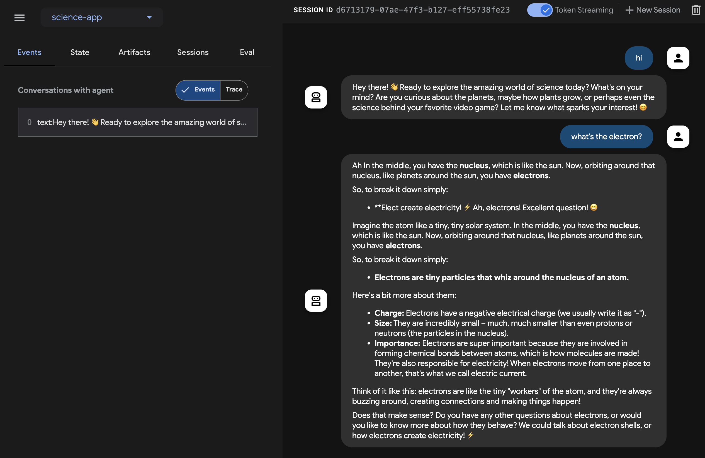

# Quickstart (Streaming / Java) {#adk-streaming-quickstart-java}

This quickstart guide will walk you through the process of creating a basic agent and leveraging ADK Streaming with Java to facilitate low-latency, bidirectional voice interactions.

You'll begin by setting up your Java and Maven environment, structuring your project, and defining the necessary dependencies. Following this, you'll create a simple `ScienceTeacherAgent`, test its text-based streaming capabilities using the Dev UI, and then progress to enabling live audio communication, transforming your agent into an interactive voice-driven application.

## **Create your first agent** {#create-your-first-agent}

### **Prerequisites**

* In this getting started guide, you will be programming in Java. Check if **Java** is installed on your machine. Ideally, you should be using Java 17 or more (you can check that by typing **java \-version**)

* You’ll also be using the **Maven** build tool for Java. So be sure to have [Maven installed](https://maven.apache.org/install.html) on your machine before going further (this is the case for Cloud Top or Cloud Shell, but not necessarily for your laptop).

### **Prepare the project structure**

To get started with ADK Java, let’s create a Maven project with the following directory structure:

```
adk-agents/
├── pom.xml
└── src/
    └── main/
        └── java/
            └── agents/
                └── ScienceTeacherAgent.java
```

Follow the instructions in [Installation](../../get-started/installation.md) page to add `pom.xml` for using the ADK package.

!!! Note
    Feel free to use whichever name you like for the root directory of your project (instead of adk-agents)

### **Running a compilation**

Let’s see if Maven is happy with this build, by running a compilation (**mvn compile** command):

```shell
$ mvn compile
[INFO] Scanning for projects...
[INFO] 
[INFO] --------------------< adk-agents:adk-agents >--------------------
[INFO] Building adk-agents 1.0-SNAPSHOT
[INFO]   from pom.xml
[INFO] --------------------------------[ jar ]---------------------------------
[INFO] 
[INFO] --- resources:3.3.1:resources (default-resources) @ adk-demo ---
[INFO] skip non existing resourceDirectory /home/user/adk-demo/src/main/resources
[INFO] 
[INFO] --- compiler:3.13.0:compile (default-compile) @ adk-demo ---
[INFO] Nothing to compile - all classes are up to date.
[INFO] ------------------------------------------------------------------------
[INFO] BUILD SUCCESS
[INFO] ------------------------------------------------------------------------
[INFO] Total time:  1.347 s
[INFO] Finished at: 2025-05-06T15:38:08Z
[INFO] ------------------------------------------------------------------------
```

Looks like the project is set up properly for compilation\!

### **Creating an agent**

Create the **ScienceTeacherAgent.java** file under the `src/main/java/agents/` directory with the following content:

```java
package samples.liveaudio;

import com.google.adk.agents.BaseAgent;
import com.google.adk.agents.LlmAgent;

/** Science teacher agent. */
public class ScienceTeacherAgent {

  // Field expected by the Dev UI to load the agent dynamically
  // (the agent must be initialized at declaration time)
  public static BaseAgent ROOT_AGENT = initAgent();

  public static BaseAgent initAgent() {
    return LlmAgent.builder()
        .name("science-app")
        .description("Science teacher agent")
        .model("gemini-2.0-flash-exp")
        .instruction("""
            You are a helpful science teacher that explains
            science concepts to kids and teenagers.
            """)
        .build();
  }
}
```

!!!note "Troubleshooting"

    The model `gemini-2.0-flash-exp` will be deprecated in the future. If you see any issues on using it, try using `gemini-2.0-flash-live-001` instead

We will use `Dev UI` to run this agent later. For the tool to automatically recognize the agent, its Java class has to comply with the following two rules:

* The agent should be stored in a global **public static** variable named **ROOT\_AGENT** of type **BaseAgent** and initialized at declaration time.
* The agent definition has to be a **static** method so it can be loaded during the class initialization by the dynamic compiling classloader.

## **Run agent with Dev UI** {#run-agent-with-adk-web-server}

`Dev UI` is a web server where you can quickly run and test your agents for development purpose, without building your own UI application for the agents.

### **Define environment variables**

To run the server, you’ll need to export two environment variables:

* a Gemini key that you can [get from AI Studio](https://ai.google.dev/gemini-api/docs/api-key),
* a variable to specify we’re not using Vertex AI this time.

```shell
export GOOGLE_GENAI_USE_VERTEXAI=FALSE
export GOOGLE_API_KEY=YOUR_API_KEY
```

### **Run Dev UI**

Run the following command from the terminal to launch the Dev UI.

```console title="terminal"
mvn exec:java \
    -Dexec.mainClass="com.google.adk.web.AdkWebServer" \
    -Dexec.args="--adk.agents.source-dir=src/main/java" \
    -Dexec.classpathScope="compile"
```

**Step 1:** Open the URL provided (usually `http://localhost:8080` or
`http://127.0.0.1:8080`) directly in your browser.

**Step 2.** In the top-left corner of the UI, you can select your agent in
the dropdown. Select "science-app".

!!!note "Troubleshooting"

    If you do not see "science-app" in the dropdown menu, make sure you
    are running the `mvn` command at the location where your Java source code
    is located (usually `src/main/java`).

## Try Dev UI with text

With your favorite browser, navigate to: [http://127.0.0.1:8080/](http://127.0.0.1:8080/)

You should see the following interface:



Click the `Token Streaming` switch at the top right, and ask any questions for the science teacher such as `What's the electron?`. Then you should see the output text in streaming on the UI.

As we saw, you do not have to write any specific code in the agent itself for the text streaming capability. It is provided as an ADK Agent feature by default.

### Try with voice and video

To try with voice, reload the web browser, click the microphone button to enable the voice input, and ask the same question in voice. You will hear the answer in voice in real-time.

To try with video, reload the web browser, click the camera button to enable the video input, and ask questions like "What do you see?". The agent will answer what they see in the video input.

### Stop the tool

Stop the tool by pressing `Ctrl-C` on the console.

## **Run agent with a custom live audio app** {#run-agent-with-live-audio}

Now, let's try audio streaming with the agent and a custom live audio application.

### **A Maven pom.xml build file for Live Audio**

Replace your existing pom.xml with the following.

```xml
<?xml version="1.0" encoding="UTF-8"?>
<project xmlns="http://maven.apache.org/POM/4.0.0"
  xmlns:xsi="http://www.w3.org/2001/XMLSchema-instance"
  xsi:schemaLocation="http://maven.apache.org/POM/4.0.0 http://maven.apache.org/xsd/maven-4.0.0.xsd">
  <modelVersion>4.0.0</modelVersion>

  <groupId>com.google.adk.samples</groupId>
  <artifactId>google-adk-sample-live-audio</artifactId>
  <version>0.1.0</version>
  <name>Google ADK - Sample - Live Audio</name>
  <description>
    A sample application demonstrating a live audio conversation using ADK,
    runnable via samples.liveaudio.LiveAudioRun.
  </description>
  <packaging>jar</packaging>

  <properties>
    <project.build.sourceEncoding>UTF-8</project.build.sourceEncoding>
    <java.version>17</java.version>
    <auto-value.version>1.11.0</auto-value.version>
    <!-- Main class for exec-maven-plugin -->
    <exec.mainClass>samples.liveaudio.LiveAudioRun</exec.mainClass>
    <google-adk.version>0.1.0</google-adk.version>
  </properties>

  <dependencyManagement>
    <dependencies>
      <dependency>
        <groupId>com.google.cloud</groupId>
        <artifactId>libraries-bom</artifactId>
        <version>26.53.0</version>
        <type>pom</type>
        <scope>import</scope>
      </dependency>
    </dependencies>
  </dependencyManagement>

  <dependencies>
    <dependency>
      <groupId>com.google.adk</groupId>
      <artifactId>google-adk</artifactId>
      <version>${google-adk.version}</version>
    </dependency>
    <dependency>
      <groupId>commons-logging</groupId>
      <artifactId>commons-logging</artifactId>
      <version>1.2</version> <!-- Or use a property if defined in a parent POM -->
    </dependency>
  </dependencies>

  <build>
    <plugins>
      <plugin>
        <groupId>org.apache.maven.plugins</groupId>
        <artifactId>maven-compiler-plugin</artifactId>
        <version>3.13.0</version>
        <configuration>
          <source>${java.version}</source>
          <target>${java.version}</target>
          <parameters>true</parameters>
          <annotationProcessorPaths>
            <path>
              <groupId>com.google.auto.value</groupId>
              <artifactId>auto-value</artifactId>
              <version>${auto-value.version}</version>
            </path>
          </annotationProcessorPaths>
        </configuration>
      </plugin>
      <plugin>
        <groupId>org.codehaus.mojo</groupId>
        <artifactId>build-helper-maven-plugin</artifactId>
        <version>3.6.0</version>
        <executions>
          <execution>
            <id>add-source</id>
            <phase>generate-sources</phase>
            <goals>
              <goal>add-source</goal>
            </goals>
            <configuration>
              <sources>
                <source>.</source>
              </sources>
            </configuration>
          </execution>
        </executions>
      </plugin>
      <plugin>
        <groupId>org.codehaus.mojo</groupId>
        <artifactId>exec-maven-plugin</artifactId>
        <version>3.2.0</version>
        <configuration>
          <mainClass>${exec.mainClass}</mainClass>
          <classpathScope>runtime</classpathScope>
        </configuration>
      </plugin>
    </plugins>
  </build>
</project>
```

### **Creating Live Audio Run tool**

Create the **LiveAudioRun.java** file under the `src/main/java/` directory with the following content. This tool runs the agent on it with live audio input and output.

```java

package samples.liveaudio;

import com.google.adk.agents.LiveRequestQueue;
import com.google.adk.agents.RunConfig;
import com.google.adk.events.Event;
import com.google.adk.runner.Runner;
import com.google.adk.sessions.InMemorySessionService;
import com.google.common.collect.ImmutableList;
import com.google.genai.types.Blob;
import com.google.genai.types.Modality;
import com.google.genai.types.PrebuiltVoiceConfig;
import com.google.genai.types.Content;
import com.google.genai.types.Part;
import com.google.genai.types.SpeechConfig;
import com.google.genai.types.VoiceConfig;
import io.reactivex.rxjava3.core.Flowable;
import java.io.ByteArrayOutputStream;
import java.io.InputStream;
import java.net.URL;
import javax.sound.sampled.AudioFormat;
import javax.sound.sampled.AudioInputStream;
import javax.sound.sampled.AudioSystem;
import javax.sound.sampled.DataLine;
import javax.sound.sampled.LineUnavailableException;
import javax.sound.sampled.Mixer;
import javax.sound.sampled.SourceDataLine;
import javax.sound.sampled.TargetDataLine;
import java.util.UUID;
import java.util.concurrent.ExecutorService;
import java.util.concurrent.ConcurrentHashMap;
import java.util.concurrent.ConcurrentMap;
import java.util.concurrent.Executors;
import java.util.concurrent.Future;
import java.util.concurrent.TimeUnit;
import java.util.concurrent.atomic.AtomicBoolean;
import agents.ScienceTeacherAgent;

/** Main class to demonstrate running the {@link LiveAudioAgent} for a voice conversation. */
public final class LiveAudioRun {
  private final String userId;
  private final String sessionId;
  private final Runner runner;

  private static final javax.sound.sampled.AudioFormat MIC_AUDIO_FORMAT =
      new javax.sound.sampled.AudioFormat(16000.0f, 16, 1, true, false);

  private static final javax.sound.sampled.AudioFormat SPEAKER_AUDIO_FORMAT =
      new javax.sound.sampled.AudioFormat(24000.0f, 16, 1, true, false);

  private static final int BUFFER_SIZE = 4096;

  public LiveAudioRun() {
    this.userId = "test_user";
    String appName = "LiveAudioApp";
    this.sessionId = UUID.randomUUID().toString();

    InMemorySessionService sessionService = new InMemorySessionService();
    this.runner = new Runner(ScienceTeacherAgent.ROOT_AGENT, appName, null, sessionService);

    ConcurrentMap<String, Object> initialState = new ConcurrentHashMap<>();
    var unused =
        sessionService.createSession(appName, userId, initialState, sessionId).blockingGet();
  }

  private void runConversation() throws Exception {
    System.out.println("Initializing microphone input and speaker output...");

    RunConfig runConfig =
        RunConfig.builder()
            .setStreamingMode(RunConfig.StreamingMode.BIDI)
            .setResponseModalities(ImmutableList.of(new Modality("AUDIO")))
            .setSpeechConfig(
                SpeechConfig.builder()
                    .voiceConfig(
                        VoiceConfig.builder()
                            .prebuiltVoiceConfig(
                                PrebuiltVoiceConfig.builder().voiceName("Aoede").build())
                            .build())
                    .languageCode("en-US")
                    .build())
            .build();

    LiveRequestQueue liveRequestQueue = new LiveRequestQueue();

    Flowable<Event> eventStream =
        this.runner.runLive(
            runner.sessionService().createSession(userId, sessionId).blockingGet(),
            liveRequestQueue,
            runConfig);

    AtomicBoolean isRunning = new AtomicBoolean(true);
    AtomicBoolean conversationEnded = new AtomicBoolean(false);
    ExecutorService executorService = Executors.newFixedThreadPool(2);

    // Task for capturing microphone input
    Future<?> microphoneTask =
        executorService.submit(() -> captureAndSendMicrophoneAudio(liveRequestQueue, isRunning));

    // Task for processing agent responses and playing audio
    Future<?> outputTask =
        executorService.submit(
            () -> {
              try {
                processAudioOutput(eventStream, isRunning, conversationEnded);
              } catch (Exception e) {
                System.err.println("Error processing audio output: " + e.getMessage());
                e.printStackTrace();
                isRunning.set(false);
              }
            });

    // Wait for user to press Enter to stop the conversation
    System.out.println("Conversation started. Press Enter to stop...");
    System.in.read();

    System.out.println("Ending conversation...");
    isRunning.set(false);

    try {
      // Give some time for ongoing processing to complete
      microphoneTask.get(2, TimeUnit.SECONDS);
      outputTask.get(2, TimeUnit.SECONDS);
    } catch (Exception e) {
      System.out.println("Stopping tasks...");
    }

    liveRequestQueue.close();
    executorService.shutdownNow();
    System.out.println("Conversation ended.");
  }

  private void captureAndSendMicrophoneAudio(
      LiveRequestQueue liveRequestQueue, AtomicBoolean isRunning) {
    TargetDataLine micLine = null;
    try {
      DataLine.Info info = new DataLine.Info(TargetDataLine.class, MIC_AUDIO_FORMAT);
      if (!AudioSystem.isLineSupported(info)) {
        System.err.println("Microphone line not supported!");
        return;
      }

      micLine = (TargetDataLine) AudioSystem.getLine(info);
      micLine.open(MIC_AUDIO_FORMAT);
      micLine.start();

      System.out.println("Microphone initialized. Start speaking...");

      byte[] buffer = new byte[BUFFER_SIZE];
      int bytesRead;

      while (isRunning.get()) {
        bytesRead = micLine.read(buffer, 0, buffer.length);

        if (bytesRead > 0) {
          byte[] audioChunk = new byte[bytesRead];
          System.arraycopy(buffer, 0, audioChunk, 0, bytesRead);

          Blob audioBlob = Blob.builder().data(audioChunk).mimeType("audio/pcm").build();

          liveRequestQueue.realtime(audioBlob);
        }
      }
    } catch (LineUnavailableException e) {
      System.err.println("Error accessing microphone: " + e.getMessage());
      e.printStackTrace();
    } finally {
      if (micLine != null) {
        micLine.stop();
        micLine.close();
      }
    }
  }

  private void processAudioOutput(
      Flowable<Event> eventStream, AtomicBoolean isRunning, AtomicBoolean conversationEnded) {
    SourceDataLine speakerLine = null;
    try {
      DataLine.Info info = new DataLine.Info(SourceDataLine.class, SPEAKER_AUDIO_FORMAT);
      if (!AudioSystem.isLineSupported(info)) {
        System.err.println("Speaker line not supported!");
        return;
      }

      final SourceDataLine finalSpeakerLine = (SourceDataLine) AudioSystem.getLine(info);
      finalSpeakerLine.open(SPEAKER_AUDIO_FORMAT);
      finalSpeakerLine.start();

      System.out.println("Speaker initialized.");

      for (Event event : eventStream.blockingIterable()) {
        if (!isRunning.get()) {
          break;
        }
        event.content().ifPresent(content -> content.parts().ifPresent(parts -> parts.forEach(part -> playAudioData(part, finalSpeakerLine))));
      }

      speakerLine = finalSpeakerLine; // Assign to outer variable for cleanup in finally block
    } catch (LineUnavailableException e) {
      System.err.println("Error accessing speaker: " + e.getMessage());
      e.printStackTrace();
    } finally {
      if (speakerLine != null) {
        speakerLine.drain();
        speakerLine.stop();
        speakerLine.close();
      }
      conversationEnded.set(true);
    }
  }

  private void playAudioData(Part part, SourceDataLine speakerLine) {
    part.inlineData()
        .ifPresent(
            inlineBlob ->
                inlineBlob
                    .data()
                    .ifPresent(
                        audioBytes -> {
                          if (audioBytes.length > 0) {
                            System.out.printf(
                                "Playing audio (%s): %d bytes%n",
                                inlineBlob.mimeType(),
                                audioBytes.length);
                            speakerLine.write(audioBytes, 0, audioBytes.length);
                          }
                        }));
  }

  private void processEvent(Event event, java.util.concurrent.atomic.AtomicBoolean audioReceived) {
    event
        .content()
        .ifPresent(
            content ->
                content
                    .parts()
                    .ifPresent(parts -> parts.forEach(part -> logReceivedAudioData(part, audioReceived))));
  }

  private void logReceivedAudioData(Part part, AtomicBoolean audioReceived) {
    part.inlineData()
        .ifPresent(
            inlineBlob ->
                inlineBlob
                    .data()
                    .ifPresent(
                        audioBytes -> {
                          if (audioBytes.length > 0) {
                            System.out.printf(
                                "    Audio (%s): received %d bytes.%n",
                                inlineBlob.mimeType(),
                                audioBytes.length);
                            audioReceived.set(true);
                          } else {
                            System.out.printf(
                                "    Audio (%s): received empty audio data.%n",
                                inlineBlob.mimeType());
                          }
                        }));
  }

  public static void main(String[] args) throws Exception {
    LiveAudioRun liveAudioRun = new LiveAudioRun();
    liveAudioRun.runConversation();
    System.out.println("Exiting Live Audio Run.");
  }
}
```

### **Run the Live Audio Run tool**

To run Live Audio Run tool, use the following command on the `adk-agents` directory:

```
mvn compile exec:java
```

Then you should see:

```
$ mvn compile exec:java
...
Initializing microphone input and speaker output...
Conversation started. Press Enter to stop...
Speaker initialized.
Microphone initialized. Start speaking...
```

With this message, the tool is ready to take voice input. Talk to the agent with a question like `What's the electron?`.

!!! Caution
    When you observe the agent keep speaking by itself and doesn't stop, try using earphones to suppress the echoing.

## **Summary** {#summary}

Streaming for ADK enables developers to create agents capable of low-latency, bidirectional voice and video communication, enhancing interactive experiences. The article demonstrates that text streaming is a built-in feature of ADK Agents, requiring no additional specific code, while also showcasing how to implement live audio conversations for real-time voice interaction with an agent. This allows for more natural and dynamic communication, as users can speak to and hear from the agent seamlessly.
