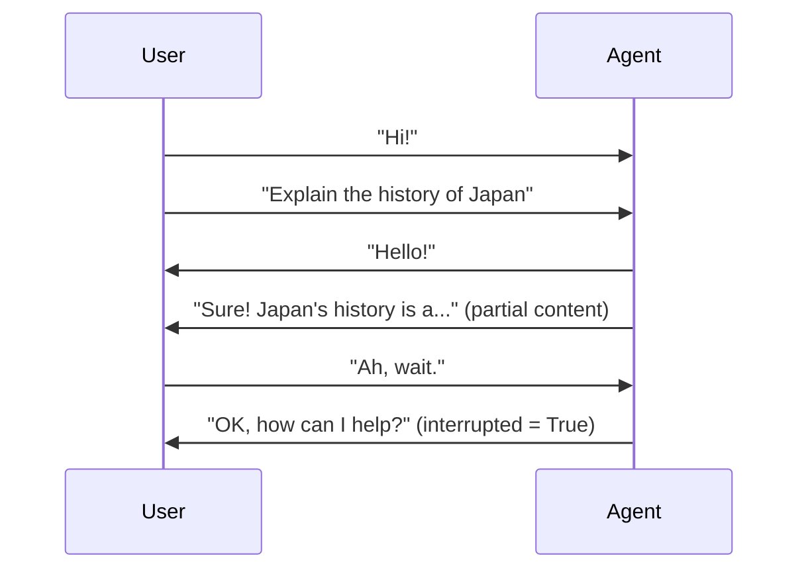
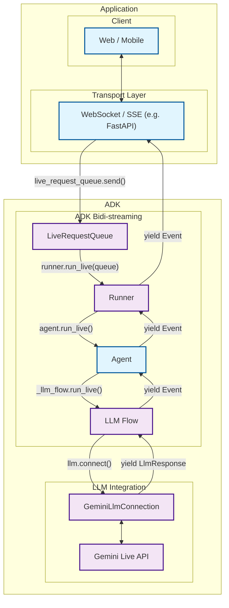

# ADK Bidi-streaming development guide: Part 1 - Introduction

Welcome to the world of bidirectional streaming with [Agent Development Kit (ADK)](https://google.github.io/adk-docs/). This article will transform your understanding of AI agent communication from traditional request-response patterns to dynamic, real-time conversations that feel as natural as talking to another person.

Imagine building an AI assistant that doesn't just wait for you to finish speaking before responding, but actively listens and can be interrupted mid-sentence when you have a sudden thought. Picture creating customer support bots that handle audio, video, and text simultaneously while maintaining context throughout the conversation. This is the power of bidirectional streaming, and ADK makes it accessible to every developer.

## 1.1 What is Bidi-streaming?

Bidi-streaming (Bidirectional streaming) represents a fundamental shift from traditional AI interactions. Instead of the rigid "ask-and-wait" pattern, it enables **real-time, two-way communication** where both human and AI can speak, listen, and respond simultaneously. This creates natural, human-like conversations with immediate responses and the revolutionary ability to interrupt ongoing interactions.

Think of the difference between sending emails and having a phone conversation. Traditional AI interactions are like emails—you send a complete message, wait for a complete response, then send another complete message. Bidirectional streaming is like a phone conversation—fluid, natural, with the ability to interrupt, clarify, and respond in real-time.

### Key Characteristics

These characteristics distinguish bidirectional streaming from traditional AI interactions and make it uniquely powerful for creating engaging user experiences:

- **Two-way Communication**: Continuous data exchange without waiting for complete responses. Either the user and AI can start responding to the first few words of your question while you're still speaking, creating an experience that feels genuinely conversational rather than transactional.

- **Responsive Interruption**: Perhaps the most important feature for the natural user experience—users can interrupt the agent mid-response with new input, just like in human conversation. If an AI is explaining quantum physics and you suddenly ask "wait, what's an electron?", the AI stops immediately and addresses your question.

- **Best for Multimodal**: Simultaneous support for text, audio, and video inputs creates rich, natural interactions. Users can speak while showing documents, type follow-up questions during voice calls, or seamlessly switch between communication modes without losing context.



### Difference from Other Streaming Types

Understanding how bidirectional streaming differs from other approaches is crucial for appreciating its unique value. The streaming landscape includes several distinct patterns, each serving different use cases:

!!! info "Streaming Types Comparison"

    **Bidi-streaming** differs fundamentally from other streaming approaches:

    - **Server-Side Streaming**: One-way data flow from server to client. Like watching a live video stream—you receive continuous data but can't interact with it in real-time. Useful for dashboards or live feeds, but not for conversations.

    - **Token-Level Streaming**: Sequential text token delivery without interruption. The AI generates response word-by-word, but you must wait for completion before sending new input. Like watching someone type a message in real-time—you see it forming, but can't interrupt.

    - **Bidirectional Streaming**: Full two-way communication with interruption support. True conversational AI where both parties can speak, listen, and respond simultaneously. This is what enables natural dialogue where you can interrupt, clarify, or change topics mid-conversation.

### Real-World Applications

Bidirectional streaming revolutionizes agentic AI applications by enabling agents to operate with human-like responsiveness and intelligence. These applications showcase how streaming transforms static AI interactions into dynamic, agent-driven experiences that feel genuinely intelligent and proactive.

In a video of the [Shopper's Concierge demo](https://www.youtube.com/watch?v=LwHPYyw7u6U), the multimodal, bi-directional streaming feature significantly improve the user experience of e-commerce by enabling a faster and more intuitive shopping experience. The combination of conversational understanding and rapid, parallelized searching culminates in advanced capabilities like virtual try-on, boosting buyer confidence and reducing the friction of online shopping.

<div class="video-grid">
  <div class="video-item">
    <div class="video-container">
      <iframe src="https://www.youtube-nocookie.com/embed/LwHPYyw7u6U?si=xxIEhnKBapzQA6VV" title="Shopper's Concierge" frameborder="0" allow="accelerometer; autoplay; clipboard-write; encrypted-media; gyroscope; picture-in-picture; web-share" referrerpolicy="strict-origin-when-cross-origin" allowfullscreen></iframe>
    </div>
  </div>
</div>

Also, there are many possible real-world applications for bidirectional streaming:

- **Customer Service & Contact Centers**: This is the most direct application. The technology can create sophisticated virtual agents that go far beyond traditional chatbots.

  - Use case: A customer calls a retail company's support line about a defective product.
  - Multimodality (video): The customer can say, "My coffee machine is leaking from the bottom, let me show you." They can then use their phone's camera to stream live video of the issue. The AI agent can use its vision capabilities to identify the model and the specific point of failure.
  - Live Interaction & Interruption: If the agent says, "Okay, I'm processing a return for your Model X coffee maker," the customer can interrupt with, "No, wait, it's the Model Y Pro," and the agent can immediately correct its course without restarting the conversation.

- **E-commerce & Personalized Shopping**: The agent can act as a live, interactive personal shopper, enhancing the online retail experience.

  - Use Case: A user is browsing a fashion website and wants styling advice.
  - Multimodality (Voice & Image): The user can hold up a piece of clothing to their webcam and ask, "Can you find me a pair of shoes that would go well with these pants?" The agent analyzes the color and style of the pants.
  - Live Interaction: The conversation can be a fluid back-and-forth: "Show me something more casual." ... "Okay, how about these sneakers?" ... "Perfect, add the blue ones in size 10 to my cart."

- **Field Service & Technical Assistance**: Technicians working on-site can use a hands-free, voice-activated assistant to get real-time help.

  - Use Case: An HVAC technician is on-site trying to diagnose a complex commercial air conditioning unit.
  - Multimodality (Video & Voice): The technician, wearing smart glasses or using a phone, can stream their point-of-view to the AI agent. They can ask, "I'm hearing a strange noise from this compressor. Can you identify it and pull up the diagnostic flowchart for this model?"
  - Live Interaction: The agent can guide the technician step-by-step, and the technician can ask clarifying questions or interrupt at any point without taking their hands off their tools.

- **Healthcare & Telemedicine**: The agent can serve as a first point of contact for patient intake, triage, and basic consultations.

  - Use Case: A patient uses a provider's app for a preliminary consultation about a skin condition.
  - Multimodality (Video/Image): The patient can securely share a live video or high-resolution image of a rash. The AI can perform a preliminary analysis and ask clarifying questions.

- **Financial Services & Wealth Management**: An agent can provide clients with a secure, interactive, and data-rich way to manage their finances.

  - Use Case: A client wants to review their investment portfolio and discuss market trends.
  - Multimodality (Screen Sharing): The agent can share its screen to display charts, graphs, and portfolio performance data. The client could also share their screen to point to a specific news article and ask, "What is the potential impact of this event on my tech stocks?"
  - Live Interaction: Analyze the client's current portfolio allocation by accessing their account data.Simulate the impact of a potential trade on the portfolio's risk profile.

## 1.2 ADK Streaming Architecture Overview

ADK Bidi-streaming architecture enables bidirectional AI conversations feel as natural as human dialogue. The architecture seamlessly integrates with Google's [Gemini Live API](https://ai.google.dev/gemini-api/docs/live) through a sophisticated pipeline that has been designed for low latency and high-throughput communication.

The system handles the complex orchestration required for real-time streaming—managing multiple concurrent data flows, handling interruptions gracefully, processing multimodal inputs simultaneously, and maintaining conversation state across dynamic interactions. ADK Bidi-streaming abstracts this complexity into simple, intuitive APIs that developers can use without needing to understand the intricate details of streaming protocols or AI model communication patterns.

### High-Level Architecture



| Developer provides: | ADK provides: | Gemini Live API provides: |
|:----------------------------|:------------------|:------------------------------|
| **Web / Mobile**: Frontend applications that users interact with, handling UI/UX, user input capture, and response display<br><br>**[WebSocket](https://developer.mozilla.org/en-US/docs/Web/API/WebSocket) / [SSE](https://developer.mozilla.org/en-US/docs/Web/API/Server-sent_events) Server**: Real-time communication server (such as [FastAPI](https://fastapi.tiangolo.com/)) that manages client connections, handles streaming protocols, and routes messages between clients and ADK<br><br>**Agent**: Custom AI agent definition with specific instructions, tools, and behavior tailored to your application's needs | **[LiveRequestQueue](https://github.com/google/adk-python/blob/main/src/google/adk/agents/live_request_queue.py)**: Message queue that buffers and sequences incoming user messages (text content, audio blobs, control signals) for orderly processing by the agent<br><br>**[Runner](https://github.com/google/adk-python/blob/main/src/google/adk/runners.py)**: Execution engine that orchestrates agent sessions, manages conversation state, and provides the `run_live()` streaming interface<br><br>**[LLM Flow](https://github.com/google/adk-python/blob/main/src/google/adk/flows/llm_flows/base_llm_flow.py)**: Processing pipeline that handles streaming conversation logic, manages context, and coordinates with language models<br><br>**[GeminiLlmConnection](https://github.com/google/adk-python/blob/main/src/google/adk/models/gemini_llm_connection.py)**: Abstraction layer that bridges ADK's streaming architecture with Gemini Live API, handling protocol translation and connection management | **[Gemini Live API](https://ai.google.dev/gemini-api/docs/live)**: Google's real-time language model service that processes streaming input, generates responses, handles interruptions, supports multimodal content (text, audio, video), and provides advanced AI capabilities like function calling and contextual understanding |

## 1.3 Setting Up Your Development Environment

Now that you understand the gist of ADK Bidi-streaming architecture and the value it provides, it's time to get hands-on experience. This section will prepare your development environment so you can start building the streaming agents and applications described in the previous sections.

By the end of this setup, you'll have everything needed to create the intelligent voice assistants, proactive customer support agents, and multi-agent collaboration platforms we've discussed. The setup process is straightforward—ADK handles the complex streaming infrastructure, so you can focus on building your agent's unique capabilities rather than wrestling with low-level streaming protocols.

### Installation Steps

#### 1. Create Virtual Environment (Recommended)

```bash
# Create virtual environment
python -m venv .venv

# Activate virtual environment
# macOS/Linux:
source .venv/bin/activate
# Windows CMD:
# .venv\Scripts\activate.bat
# Windows PowerShell:
# .venv\Scripts\Activate.ps1
```

#### 2. Install ADK

Create a `requirements.txt` file in your project root. Note that `google-adk` library includes FastAPI and uvicorn that you can use as the web server for bidi-streaming applications.

```txt
google-adk==1.3.0
python-dotenv>=1.0.0
```

Install all dependencies:

```bash
pip install -r requirements.txt
```

#### 3. Set SSL Certificate Path (macOS only)

```bash
# Required for proper SSL handling on macOS
export SSL_CERT_FILE=$(python -m certifi)
```

#### 4. Set Up API Keys

Choose your preferred platform for running agents:

=== "Google AI Studio"

    1. Get an API key from [Google AI Studio](https://aistudio.google.com/apikey)
    2. Create a `.env` file in your project root:

    ```env
    GOOGLE_GENAI_USE_VERTEXAI=FALSE
    GOOGLE_API_KEY=your_actual_api_key_here
    ```

=== "Google Cloud Vertex AI"

    1. Set up [Google Cloud project](https://cloud.google.com/vertex-ai/generative-ai/docs/start/quickstarts/quickstart-multimodal#setup-gcp)
    2. Install and configure [gcloud CLI](https://cloud.google.com/vertex-ai/generative-ai/docs/start/quickstarts/quickstart-multimodal#setup-local)
    3. Authenticate: `gcloud auth login`
    4. [Enable Vertex AI API](https://console.cloud.google.com/flows/enableapi?apiid=aiplatform.googleapis.com)
    5. Create a `.env` file in your project root:

    ```env
    GOOGLE_GENAI_USE_VERTEXAI=TRUE
    GOOGLE_CLOUD_PROJECT=your_actual_project_id
    GOOGLE_CLOUD_LOCATION=us-central1
    ```

#### 5. Create Environment Setup Script

We will create the validation script that will verify your installation:

```bash
# Create the directory structure
mkdir -p src/part1
```

Create `src/part1/1-3-1_environment_setup.py`:

```python
#!/usr/bin/env python3
"""
Part 1.3.1: Environment Setup Validation
Comprehensive script to validate ADK streaming environment configuration.
"""

import os
import sys
from pathlib import Path
from dotenv import load_dotenv

def validate_environment():
    """Validate ADK streaming environment setup."""

    print("🔧 ADK Streaming Environment Validation")
    print("=" * 45)

    # Load environment variables
    env_path = Path(__file__).parent.parent.parent / '.env'
    if env_path.exists():
        load_dotenv(env_path)
        print(f"✓ Environment file loaded: {env_path}")
    else:
        print(f"❌ Environment file not found: {env_path}")
        return False

    # Check Python version
    python_version = sys.version_info
    if python_version >= (3, 8):
        print(f"✓ Python version: {python_version.major}.{python_version.minor}.{python_version.micro}")
    else:
        print(f"❌ Python version {python_version.major}.{python_version.minor} - requires 3.8+")
        return False

    # Test ADK installation
    try:
        import google.adk
        print(f"✓ ADK import successful")

        # Try to get version if available
        try:
            from google.adk.version import __version__
            print(f"✓ ADK version: {__version__}")
        except:
            print("ℹ️ ADK version info not available")

    except ImportError as e:
        print(f"❌ ADK import failed: {e}")
        return False

    # Check essential imports
    essential_imports = [
        ('google.adk.agents', 'Agent, LiveRequestQueue'),
        ('google.adk.runners', 'InMemoryRunner'),
        ('google.genai.types', 'Content, Part, Blob'),
    ]

    for module, components in essential_imports:
        try:
            __import__(module)
            print(f"✓ Import: {module}")
        except ImportError as e:
            print(f"❌ Import failed: {module} - {e}")
            return False

    # Validate environment variables
    env_checks = [
        ('GOOGLE_GENAI_USE_VERTEXAI', 'Platform configuration'),
        ('GOOGLE_API_KEY', 'API authentication'),
    ]

    for env_var, description in env_checks:
        value = os.getenv(env_var)
        if value:
            # Mask API key for security
            display_value = value if env_var != 'GOOGLE_API_KEY' else f"{value[:10]}..."
            print(f"✓ {description}: {display_value}")
        else:
            print(f"❌ Missing: {env_var} ({description})")
            return False

    # Test basic ADK functionality
    try:
        from google.adk.agents import LiveRequestQueue
        from google.genai.types import Content, Part

        # Create test queue
        queue = LiveRequestQueue()
        test_content = Content(parts=[Part(text="Test message")])
        queue.send_content(test_content)
        queue.close()

        print("✓ Basic ADK functionality test passed")

    except Exception as e:
        print(f"❌ ADK functionality test failed: {e}")
        return False

    print("\n🎉 Environment validation successful!")
    print("\nNext steps:")
    print("• Start building your streaming agents in src/agents/")
    print("• Create custom tools in src/tools/")
    print("• Add utility functions in src/utils/")
    print("• Test with Part 3 examples")

    return True

def main():
    """Run environment validation."""

    try:
        success = validate_environment()
        sys.exit(0 if success else 1)

    except KeyboardInterrupt:
        print("\n\n⚠️ Validation interrupted by user")
        sys.exit(1)
    except Exception as e:
        print(f"\n❌ Unexpected error: {e}")
        sys.exit(1)

if __name__ == "__main__":
    main()
```

### Project Structure

Now your streaming project should now have this structure:

```text
your-streaming-project/
├── .env                              # Environment variables (API keys)
├── requirements.txt                 # Python dependencies
└── src/
    └── part1/
        └── 1-3-1_environment_setup.py  # Environment validation script
```

### Run It

Use our complete environment setup script to ensure everything is configured correctly:

```bash
python src/part1/1-3-1_environment_setup.py
```

!!! example "Expected Output"

    When you run the validation script, you should see output similar to this:

    ```
    🔧 ADK Streaming Environment Validation
    =============================================
    ✓ Environment file loaded: /path/to/your-streaming-project/.env
    ✓ Python version: 3.12.8
    ✓ ADK import successful
    ✓ ADK version: 1.3.0
    ✓ Import: google.adk.agents
    ✓ Import: google.adk.runners
    ✓ Import: google.genai.types
    ✓ Platform configuration: FALSE
    ✓ API authentication: AIzaSyAolZ...
    ✓ Basic ADK functionality test passed

    🎉 Environment validation successful!
    ```

    This comprehensive validation script checks:

    - ADK installation and version
    - Required environment variables
    - API key validation
    - Basic import verification

### Next Steps

With your environment set up, you're ready to dive into the core streaming APIs. In the next part (coming soon), You'll learn about:

- **LiveRequestQueue**: The heart of bidirectional communication
- **run_live() method**: Starting streaming sessions
- **Event processing**: Handling real-time responses
- **Gemini Live API**: Direct integration patterns
